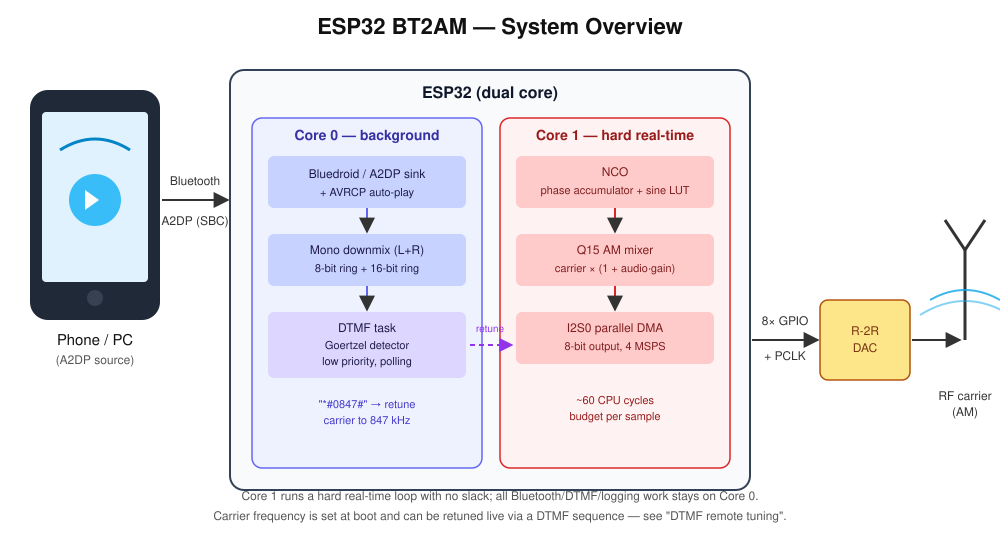
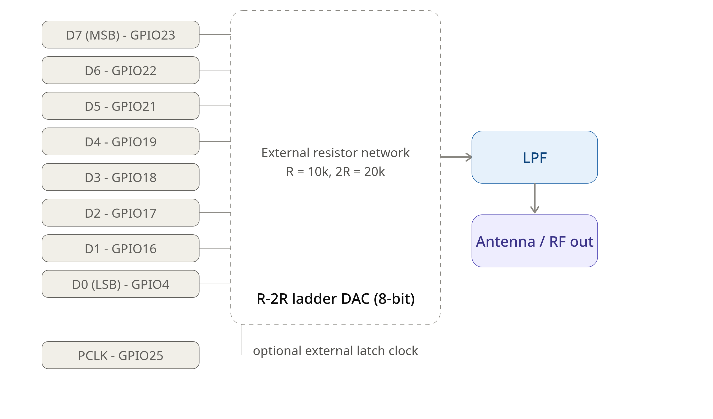

# ESP32 BT2AM — Bluetooth-to-AM Radio Transmitter

Turn an ESP32 into a Bluetooth A2DP receiver that amplitude-modulates a single
RF carrier with whatever audio your phone streams to it. No Wi-Fi, no PC, no
external audio interface — pair your phone, hit play, and the ESP32 does the
rest.

As a party trick, you can also **retune the carrier frequency live from your
phone's dial pad** by "dialing" a DTMF sequence such as `*#0847#` (see
[DTMF remote tuning](#dtmf-remote-tuning) below).

---

## How it works

```
Phone/Laptop --(Bluetooth A2DP, SBC)--> ESP32 --(I2S0 parallel DMA)--> R-2R DAC --> RF carrier
```



1. The ESP32 advertises itself as a classic Bluetooth **A2DP sink** (i.e. a
   Bluetooth speaker). Any phone or PC can pair with it and stream audio.
2. Stereo PCM audio arriving from Bluedroid is down-mixed to mono
   (`(L + R) / 2`) and fed into a ring buffer.
3. A single **NCO (Numerically Controlled Oscillator)**, driven by a
   phase accumulator and a 12-bit sine lookup table, generates the RF
   carrier at up to 4 MHz sample rate.
4. The carrier is amplitude-modulated with the incoming audio (Q15 fixed-
   point math) and written out as an 8-bit value through an **I2S0
   parallel DMA** peripheral to 8 GPIO pins, driving an external R-2R DAC
   (or similar) to produce the analog RF waveform.
5. A background task continuously listens for DTMF tones in the audio
   stream and can retune the carrier frequency on the fly (see below).

The DSP/DMA core (steps 3–4) runs as a hard real-time loop on Core 1 with
no slack — 4,000,000 samples/second leaves roughly 60 CPU cycles per sample.
Everything else (Bluetooth stack, DTMF detection, logging) runs on Core 0.

## Features

- **Bluetooth A2DP sink** — no Wi-Fi/UDP/PC required, just pair and play.
- **Automatic playback start** via a minimal AVRCP controller (sends a
  virtual "Play" command on connect — most phones start streaming without
  any manual interaction).
- **Single NCO carrier**, frequency set at startup (`START_FREQ_HZ`) and
  retunable at runtime via DTMF.
- **DTMF remote tuning**: dial `*#nnnn#` on your phone's keypad while
  connected to retune the carrier to `nnnn` kHz — no companion app needed.
- Runs on **stock ESP-IDF** (no external libraries beyond the built-in
  Bluedroid/Classic Bluetooth stack).
- Adaptive to whatever sample rate the phone negotiates (16/32/44.1/48 kHz)
  — no hardcoded assumptions.
- Live debug telemetry over UART (streaming state, ring buffer fill,
  modulation peak, Bluetooth packet/byte counters).

## Hardware

- **Target**: ESP32 (classic, dual-core, with Bluetooth Classic support).
  ESP32-S2/S3/C-series chips do **not** support classic Bluetooth/A2DP and
  will not work with this firmware as-is.
- **DAC**: 8 parallel GPIOs drive an external R-2R resistor ladder DAC (or
  equivalent), clocked by a `PCLK` output pin.

  


(See `data_pins[]` / `PCLK_PIN` in the source if you need to remap.)

## Building

Requires [ESP-IDF](https://github.com/espressif/esp-idf) (developed against
v6.1).

```bash
idf.py set-target esp32
idf.py menuconfig
```

In menuconfig, make sure the following are enabled:

- `Component config → Bluetooth → Bluetooth` (enables `CONFIG_BT_ENABLED`)
- `Bluetooth host` → **Bluedroid**
- `Bluedroid Options` → **Classic Bluetooth**
- `Classic Bluetooth Options` → **A2DP** (Sink) and **AVRCP**
- `Component config → Bluetooth → Controller Options → Bluetooth controller
  mode` → **BR/EDR Only** (or **Dual Mode** if BR/EDR-only isn't offered
  for your chip revision — see note in the source comments near
  `esp_bt_controller_mem_release()` if you switch to Dual Mode)

Then:

```bash
idf.py fullclean   # important after changing Bluetooth Kconfig options
idf.py build
idf.py -p /dev/ttyUSB0 flash monitor
```

## Configuration

All tunables live as `#define`s near the top of the relevant section of
`ESP32_AMTX_BT.c` — there is no runtime config file or web UI. Key ones:

| Define | Default | Purpose |
|---|---|---|
| `BT_DEVICE_NAME` | `"ESP32-BT2AM"` | Name shown when pairing |
| `START_FREQ_HZ` | `999000` (999 kHz) | Carrier frequency at boot |
| `MOD_GAIN_Q15` | `128` | Modulation depth/index — increase for more punch, decrease if you see clipping |
| `DAC_DIVISOR` | `230` | Output scaling to 8-bit DAC range — recalibrate against your actual DAC/amplifier chain |
| `DTMF_MIN_POWER` / `DTMF_DOMINANCE_RATIO` | `2.0e7` / `2.5` | DTMF detection strictness — raise if you get false triggers from music |

## DTMF remote tuning

While connected and streaming, dial the following sequence on your phone's
keypad (e.g. in the Phone app's dialer screen, *without* actually placing a
call — the DTMF tones are generated and sent over the A2DP audio stream
regardless):

```
*#0847#
```

This retunes the carrier to **847 kHz**, live, no reboot required. The
format is strictly `*#` + exactly 4 digits + `#`. Anything that doesn't
match this exact pattern is ignored and resets the detector back to its
idle state — this was a deliberate design choice (rather than reacting to
single digits) to make accidental triggering from music or speech
extremely unlikely.

Detection runs via the [Goertzel algorithm](https://en.wikipedia.org/wiki/Goertzel_algorithm)
(cheaper than a full FFT since only the 8 standard DTMF frequencies are
evaluated) in a low-priority background task on Core 0, fully decoupled
from the real-time DSP/DMA loop on Core 1.

Watch the serial monitor for confirmation:

```
DTMF-Sequenz '*#0847#' erkannt -> NCO-Frequenz auf 847000 Hz gesetzt
```

## Debug telemetry

Once per second, the firmware logs a status line:

```
DBG streaming=1 fill=2854 audio=0 peak=93 mix=16371 | BT: rate=44100 Hz pkts=1142 bytes=4677632
```

| Field | Meaning |
|---|---|
| `streaming` | `1` once the ring buffer has pre-buffered enough audio to start modulating, `0` during startup/underrun |
| `fill` | Ring buffer fill level (samples) |
| `audio` | Instantaneous single-sample snapshot of the modulation signal — noisy by design, not a reliable level indicator |
| `peak` | Peak absolute modulation value seen in the last second — the number to actually watch when calibrating `MOD_GAIN_Q15` |
| `mix` | Instantaneous carrier+modulation output sample |
| `rate` | Actually negotiated Bluetooth sample rate |
| `pkts` / `bytes` | Cumulative A2DP packets/bytes received since connect |

## Known limitations

- **Sample rate cannot be forced to 16 kHz.** A2DP/SBC supports
  16/32/44.1/48 kHz, but as of ESP-IDF 6.1 there is no public API to make
  the sink *require* the lowest rate — the source device (phone) picks,
  and most phones default to 44.1 kHz. The firmware adapts automatically
  to whatever gets negotiated instead of assuming a fixed rate.
- **Single carrier only.** This project intentionally supports exactly one
  NCO/carrier — see commit history if you need a multi-carrier variant.
- **DTMF over lossy audio.** Because DTMF tones travel through the same
  compressed SBC audio path as music, extremely rare false positives from
  music content are theoretically possible; the strict `*#dddd#` framing
  and dual-tone dominance check make this practically negligible.

## Project history / design notes

This project evolved from an earlier WLAN/UDP-based version (audio fed in
via raw UDP packets from a PC running `ffmpeg`, carrier frequency set via a
UDP control port). That version has been fully replaced by the
self-contained Bluetooth A2DP approach described above — no PC or network
infrastructure is required at all anymore.

## License

*(Add your preferred license here — e.g. MIT, GPLv3.)*
